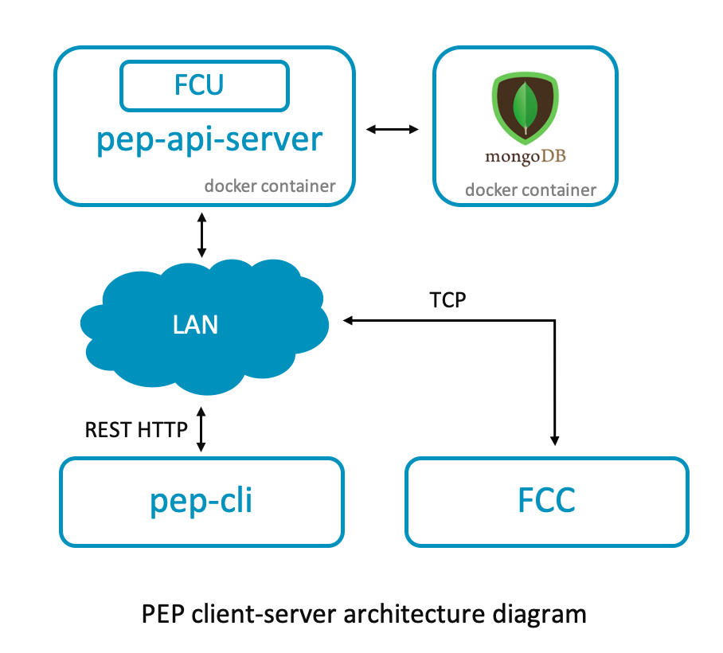

# Pelion Edge provisioning (pep) tool

The Pelion Edge provisioning (pep) tool lets you automate the gateway provisioning flow. The pep tool injects production-mode identity certificates and configuration information onto the gateways over IP. The automation is possible because of these features:

- The gateway initiates certificate injection, instead of [Factory Configurator Utility (FCU)](https://www.pelion.com/docs/device-management/current/provisioning-process/index.html), which initiates the injection in the [default Device Management provisioning flow](https://www.pelion.com/docs/device-management/current/provisioning-process/index.html).
- The pep tool records enrollment the identity and configuration information of all provisioned gateways.

## Use cases

- Manufacturing floor

  Consider a factory set up to provision Pelion Edge enabled gateways with 15 workstations running in parallel. The default provisioning flow, using FCU and FCC, requires accessing the terminal of the gateway to retrieve its IP address, serial number and the port on which FCC runs. You then have to enter the information into FCU, which typically runs outside the gateway on a local factory server. These manual steps reduce operational efficiency, increase complexity and are prone to user error. Therefore, the factory flow generally requires a headless environment in which you automate all steps, and the status is reported through the colors of the LED connected to the gateway.

  Please note that this is not a factory tool which automates the complete factory flow process. It is intended to automate the Pelion provisioning flow and provide an easy integration with the factory tool, considering factory tool is set up according to the customer's & factory's specific requirements.

  Once you configure the pep API server and run the pep tool successfully in the factory, you can provision any gateway on the same local network without any manual effort.

- Inventory management

  If your factory dispatches gateways to various end users or tenants, you need a mechanism to track gateways dispatched to specific end users. The pep tool has a database that stores information about dispatched gateways and can later be exported to manage your inventory and the ownership of gateways.

- Testing with production credentials

  You can also use the pep tool internally to iteratively test the Pelion Edge firmware in production mode without having to set up separate or individual FCUs, and your QA team can use the tool to automate regression testing and CI workflows.

## Architecture

In the default Device Management gateway provisioning flow, FCU (running outside the gateway) injects the credentials in the gateway over IP. This requires knowing the serial number and IP address of the gateway. This flow cannot be automated because it requires manual effort to read the serial number and IP address off of the gateway. The pep tool inverts this flow by providing REST APIs that allow the gateway to send its serial number and IP address to the server and request the credentials on demand.

The server also saves the identity information and gateway configurations in the database, which you can later download or upload to a server for inventory management or to prime the system for the first-to-claim process.

The server is a multicontainer Docker application with two services:

- pep API server: a node.js based RESTful web service that exposes APIs consumed by the client, [pep CLI](#cli). You can find the API documentation [in the `pelion-edge-provisioner` repository](https://github.com/armPelionEdge/pelion-edge-provisioner/blob/dev/docs/api-swagger-doc.yml). This service internally interacts with FCU and leverages the [ft-demo tool](https://www.pelion.com/docs/device-management-provision/latest/ft-demo/index.html), which provides the IP interface to inject the certificates in the gateway. Therefore, the precursor to building the Docker image is to successfully download the factory_configurator_utility archive file from the Pelion Device Management Portal and configure it according to your use case. The details of that can be found in the [Prerequisite section](#prerequisites). To know more about the Docker image the instructions used to assemble it are stated in this [Dockerfile](https://github.com/armPelionEdge/pelion-edge-provisioner/blob/dev/Dockerfile).

- Mongo: a service that deploys an instance of MongoDB. The database is used for record keeping. It stores the nonsensitive gateway information, such as gateway's serial number and its configuration parameter values. After the gateway is provisioned successfully in first-to-claim mode, it also stores the enrollment identity, which is the fingerprint of the device certificate of the gateway, but it never stores the device certificate itself. You can export the stored information into CSV format using [pep CLI](#cli), which you can use for inventory management. When using the [first-to-claim process](https://www.pelion.com/docs/device-management/current/connecting/device-ownership-first-to-claim-by-enrollment-list.html), you can upload it to the Portal using the [bulk upload feature](https://portal.mbedcloud.com/devices/enrollment/new).

You can use Docker's [compose](https://docs.docker.com/compose/) tool to configure and define the above service containers. It creates:

- A default `bridge` network which setup for containers to communicate with each other.
- A Docker volume `mongo_data` is created to persistently store the mongo data.

The environment file `.env` lists the versions of the services `docker-compose` uses.

<p align="center"></p>

## Prerequisites

### Physical setup requirements

- The server can run on any Docker supported platform and client on any Pelion Edge supported platforms. Both the server and gateway need an IP address and to be connected to the same LAN network.

- The server machine must allow inbound and outbound HTTP traffic on port 5151 and also TCP traffic on the port used by Factory Configurator Client (FCC), which is running on the client machine.

<span class="notes">**Note:** We recommend you install the server on a secure machine, in a secure room or both to protect the device keys and certificates. Set up production flow in accordance with good security practices, and use secure processes and Hardware Security Module (HSM) hardware when possible.</span>

### Software requirements

1. Create a `./fcu_config_dir` folder that contains the required files:

   ```
   ./fcu_config_dir
   --- fcu.yml
   --- factory_configurator_utility.zip
   --- update-auth-certificate.der
   --- keystore
   --- --- CA_private.pem
   --- --- CA_cert.pem
   ```
   Place the `fcu_config_dir` folder in the root directory of the repository for the contents to be copied to the Docker container.

    - `factory_configurator_utility.zip` is the FCU archive.

       Arm licenses FCU to Device Management customers who manufacture connected devices. Please [contact us](https://cloud.mbed.com/contact) for more information. Authorized customers can download the tool and documentation from the [Device Management Portal](https://portal.mbedcloud.com/login).

    - `fcu.yml` is the FCU configuration file.

       [Follow the documentation](https://www.pelion.com/docs/device-management-provision/latest/fcu/config-fcu.html) to configure FCU. You can find the default `fcu.yml` in the archive file at `factory_configurator_utility.zip/config/fcu.yml`.

       Example: Typically, we configure `fcu.yml` with the following values; everything else remains unchanged.

       | Parameter     | Value      |
       | ------------- |:----------:|
       | use-bootstrap | true |
       | time-sync | true |
       | verify-on-device | true |
       | first-to-claim | true |
       | update-auth-certificate-file | <%= ENV['FCU_RESOURCES_DIR'] %>/update-auth-certificate.der |
       | vendor-id | '42fa7b48-1a65-43aa-890f-8c704daade54' |
       | class-id | 'c56f3a62-b52b-4ef6-95a0-db7a6e3b5b21' |
       | device-info | *fill the information as per your organization* |
       | device-key-generation-mode | by_tool |
       | device-certificate | *fill the information as per your organization* |
       | entropy-generation-mode | by_device |

    -`CA_private.pem` and `CA_cert.pem` are the certificate authority (CA) private key certificate.

       When your devices connect to Device Management, they need to trust the CA certificate that issued the device certificate or one of the CAs in the device certificate chain of trust. To set up a certificate authority, follow the documentation to [create your own CA](https://www.pelion.com/docs/device-management-provision/latest/fcu/using-CA.html#creating-a-ca-certificate). Place the generated private key, `CA_private.pem`, and certificate, `CA_cert.pem`, in the `keystore` folder.

       Caution: The OpenSSL commands in the docs are for reference only. You must adapt the commands to your own production setup and security requirements.

       <span class="notes">**Note:** As you are creating your own certificate authority, do not populate the X.509 properties in the `certificate-authority` section of the `fcu.yml` configuration file.</span>

       **Upload the CA certificate**: You must upload this CA certificate to Device Management to allow it to trust the device certificates signed by this CA and then connection to Device Management. Follow [the document about managing trusted certificates](https://www.pelion.com/docs/device-management/current/provisioning-process/managing-ca-certificates.html) to learn about the various ways you can achieve this and also how to manage the lifecycle of the CAs.

       Make sure to select **Enrollment** from the "How will devices use this certificate?" dropdown.

       <span class="notes">**Note:** You can also set up [FCU as a CA](https://www.pelion.com/docs/device-management-provision/latest/fcu/fcu-ca.html), but that requires you to manually install the FCU and invoke the `setup` API. Because installation of FCU is automated in the Docker build process, we recommend you use generate your own CA.</span>

    - `update-auth-certificate.der` is the firmware update authentication certificate (optional).

       You only need this certificate if you intend to update your firmware. For more information about authentication certificate use and requirements, please see the [authenticity certificate documentation](https://www.pelion.com/docs/device-management/current/updating-firmware/update-auth-cert.html).

       For testing purposes, you can use the [manifest tool](https://github.com/ARMmbed/manifest-tool/tree/v1.5.2) to generate the authentication certificate. This enables you to develop the firmware updates for your gateway. These certificates generated above are not suitable for production environments. Only use them for testing purposes.

       For example, you can run this command to generate the update certificate:

       ```
       manifest-tool init -m "<product model identifier>" -V 42fa7b48-1a65-43aa-890f-8c704daade54 -q
       ```

       You can find the DER formatted update certificate at `.update-certificates/default.der`. Rename it to `update-auth-certificate.der`, and place it in the `./fcu_config_dir` folder.

       <span class="notes">**Note:** To unlock the rich node features, such as gateway logs and the gateway terminal in the Device Management Portal, pass the command-line parameter `-V 42fa7b48-1a65-43aa-890f-8c704daade54` to the manifest tool. Contact the service continuity team at Arm to request they enable Edge gateway features in your Device Management Portal account. By default, the features are not enabled.</span>

1. Manually run the `./fcu-config-validator.sh` validator script on `fcu_config_dir` to verify the files are in the correct structure.

## Installing the server using Docker

Use `docker-compose` to build and run the containers (these `docker-compose` commands have been tested with `docker-compose` version 1.25.0):

1. Build the pep server:

    ```
    docker-compose build --build-arg fcu_config=<fcu_config_relative_dir_path>
    ```

1. Run the pep server:

    ```
    docker-compose up -d
    ```

1. Verify that the mongo and pep API server containers are running:

    ```
    docker-compose ps
    ```

1. If a container is restarting, view the logs to troubleshoot:

    ```
    docker-compose logs
    ```

    1. View the API server logs:

        ```
        docker logs -f pep-api-server
        ```

    1. Verify the mongo_data volume was created successfully:

        ```
        docker volume inspect pelion-edge-provisioner_mongo_data
        ```

1. If the pep API server is running successfully, you can view the Swagger API docs at `http://localhost:5151/docs/`.

## Installing the pep CLI tool

pep CLI is a command-line tool that interacts with the pep API server using cURL. To test, you can run it on the same machine as the server, but in production, it runs on the Pelion Edge supported platforms. The supported commands are detailed in the [commands](#commands) section.

1. Clone this repository on your gateway:

   ```
   git clone https://github.com/armPelionEdge/pelion-edge-provisioner
   ```

1. Install pep CLI to `/usr/local/bin` by creating a symlink:

   ```
   cd pelion-edge-provisioner
   ln -s `pwd`/cli/bash/pep-cli.sh /usr/local/bin/pep-cli
   pep-cli --help
   ```

   <span class="notes">**Note:** Make sure `/usr/local/bin` is already in your PATH. To verify, run `echo $PATH`. If it is not in your PATH, add it.</span>

   Alternatively, go to:

   ```
   cd cli/bash
   ./pep-cli.sh --help
   ```

1. To enable debug mode:

   ```
   DEBUG=* pep-cli --help
   ```

1. When you run the CLI on the gateway, you can provide the PEP_SERVER_URL as an env variable:

   ```
   PEP_SERVER_URL=http://<api-server-ip-address>:5151 pep-cli --help
   ```

### Commands

- `get-one-identity`: Requests the pep API server to create a new identity based on the passed parameters. The prerequisite is to run FCC first. The steps on how to install and run FCC are documented in the next section.

   - In the request to the server, provide the gateway IP address and the port at which FCC is running, so the server can then invoke FCU to inject a new device certificate in the gateway.
   - Run the `help` command to learn about the various parameters you can pass:

       ```
       pep-cli get-one-identity --help
       ```

   <p align="center"></p>

- `get-enrollment-id`: After the gateway has been injected with a device certificate, you can request the server to provide the enrollment ID of the gateway, so you can upload it to the Device Management account with which you want the gateway to be associated:

   ```
   pep-cli get-enrollment-id --help
   ```

- `list-enrollment-ids`: Gets the enrollment identities of dispatched gateways in CSV and JSON format. The CSV formatted information is compatible with the [bulk upload feature](https://portal.mbedcloud.com/devices/enrollment/new) of Portal. Therefore, the information can directly be uploaded to a Pelion account through the Portal or using the [bulk upload REST API](https://www.pelion.com/docs/device-management-api/enrollment/). The command returns paginated data. By default, the command returns 50 entries in descending order. To enumerate through the list, you can provide the following command line parameters:
    - `limit`: Number of results to return. Between 1 and 1000.
    - `order`: The order in which the identities have been dispatched. `ASC` for ascending, `DESC` for descending.
    - `last`: The ID of the last entry in the previous result. Marks the start of the next page.

    For more information, run:

    ```
    pep-cli list-enrollment-ids --help
    ```

## Typical production provisioning and onboarding flow

1. Install FCC:

   1. Log in to the gateway.
   1. If `factory-configurator-client-example` is not installed, follow [the document about building the FCC example on native Linux](https://www.pelion.com/docs/device-management-provision/latest/ft-demo/building-demo.html#native-linux) for the detailed steps. Below are the quick steps that install the program. For example, in the `meta-pelion-edge` project you can find the precompiled binary located at `/wigwag/wwrelay-utils/I2C/factory-configurator-client-armcompiled.elf`.

   <span class="notes">**Note:** This tool is not supported on macOS, so if you are running the server on macOS, you can't test pep CLI on the same machine.</span>

   ```
   pip install mbed-cli
   git clone https://github.com/ARMmbed/factory-configurator-client-example.git
   cd factory-configurator-client-example
   rm -rf mbed-os.lib
   mbed deploy
   python pal-platform/pal-platform.py deploy --target=x86_x64_NativeLinux_mbedtls generate
   cd __x86_x64_NativeLinux_mbedtls
   cmake -G "Unix Makefiles" -DCMAKE_BUILD_TYPE=Release -DCMAKE_TOOLCHAIN_FILE=./../pal-platform/Toolchain/GCC/GCC.cmake -DEXTERNAL_DEFINE_FILE=./../linux-config.cmake
   make factory-configurator-client-example.elf
   ```

   Binary is located at:

   ```
   ./Release/factory-configurator-client-example.elf
   ```

1. Prepare:

   1. Stop Edge Core, and clear out the old provisioning files. For example, if you are running [meta-pelion-edge](https://github.com/armPelionEdge/meta-pelion-edge) on Raspberry Pi 3 Model B+, run the following commands:

      ```
      systemctl stop edge-core
      rm -rf /userdata/mbed/mcc_config
      rm -rf /userdata/edge_gw_config
      ```

      or run this script:

      ```
      ./example-scripts/meta-pelion-edge/prepare-for-new-identity.sh
      ```

   1. Modify the commands or the scripts for your platform.

1. Run FCC:

   1. On the gateway, run this command:

      ```
      ./factory-configurator-client-example.elf
      ```

      By default, the interface is `eth0`. If required, you can change the interface name:

      ```
      ETHERNET_LINUX_IFACE_NAME=wlan0 ./factory-configurator-client-example.elf
      ```

      You can change the entropy source:

      ```
      export ENTROPYSOURCE=/dev/urandom
      ```

   1. Note down the TCP port of FCC: You will use it in the next step.

1. Fetch a new identity:

   1. Open another terminal.
   1. Log in to the gateway.
   1. Run the following command. At minimum, you must pass in the serial number of the gateway, the IP address of the gateway and the TCP port at which FCC is running.

   <span class="notes">**Note:** There is no schema enforced on the `serial_number`, but we recommend using only the characters `a-z`, `A-Z`,`0-9`, `'+,-.:/=` and `SPACE`. For more information, see [endpoint name](https://www.pelion.com/docs/device-management-provision/1.2/provisioning-info/general-device-information.html#endpoint-name). However, it has to be unique. The server will not provision two gateways with the same serial number.</span>

   ```
   PEP_SERVER_URL=http://<api-server-ip-address>:5151 pep-cli get-one-identity -s <serial_number> -i <gateway_ip> -p <fcc_port>
   ```

1. Install a new identity. After the above command runs successfully, the factory-configurator-client-example creates a `pal` folder, and pep CLI creates `identity.json` file.

   1. Place and rename the `pal` folder to the location specified by the compile time flag `PAL_FS_MOUNT_POINT_PRIMARY` of Edge Core. By default, its defined by [this CMake flag](https://github.com/ARMmbed/mbed-edge/blob/master/cmake/targets/default.cmake#L7). The [meta-pelion-edge](https://github.com/armPelionEdge/meta-pelion-edge) project overwrites that to [this](https://github.com/armPelionEdge/meta-pelion-edge/blob/master/recipes-wigwag/mbed-edge-core/files/rpi3/target.cmake#L8) and [snap-pelion-edge](https://github.com/armPelionEdge/snap-pelion-edge) to [this](https://github.com/armPelionEdge/snap-pelion-edge/blob/master/files/edge-core/cmake/target.cmake#L6).

      <span class="notes">**Note:** Before copying to that location, make sure the folder is not present. Edge Core creates this folder only if this folder is not already present. Therefore, stop Edge Core, and clear out that folder before copying the `pal` folder.</span>

   1. Place the `identity.json` to the location specified by `platform_readers/params/identity_path` of Maestro configuration file. In `meta-pelion-edge`, its placed at [this location](https://github.com/armPelionEdge/meta-pelion-edge/blob/master/recipes-wigwag/maestro/maestro/rpi3/maestro-config-rpi3bplus.yaml#L27) and for `snap-pelion-edge` at [this](https://github.com/armPelionEdge/edge-utils/blob/master/conf/maestro-conf/edge-config-dell5000-demo.yaml#L16).

   For example, in `meta-pelion-edge`, you can run the following commands:

   ```
   mkdir -p /userdata/edge_gw_config
   mv identity.json /userdata/edge_gw_config/
   mv pal/ /userdata/mbed/mcc_config
   ```

   The same steps are listed in this script. You can modify this script for your platform:

   ```
   ./example-scripts/meta-pelion-edge/install-new-identity.sh
   ```

1. Upload the enrollment identity:

   1. To retrieve the enrollment ID of this gateway, send a request to the pep API server.

   ```
   pep-cli get-enrollment-id -s <serial_number>
   ```

   1. Upload the enrollment identity to Device Management by following [the First-to-Claim by enrollment list documentation](https://www.pelion.com/docs/device-management/current/connecting/device-ownership-first-to-claim-by-enrollment-list.html)

1. Connect to Device Management:

   1. Reboot the gateway.
   1. Verify the gateway is connected to Device Management. For example, in `meta-pelion-edge`, you can run this command to know the status of Edge Core:

   ```
   curl localhost:9101/status
   ```

## How to automate the provisioning flow

1. Pre-installed FCC with the Pelion Edge firmware image.
1. Create a bash script to:
    1. Start FCC and capture the TCP port.
    1. Read the serial number of the gateway. For example, you can find serial number in `/proc/cpuinfo` on Raspberry Pi.
    1. Get the IP address of the gateway. For example, you can grep the IP address from `ifconfig`.
    1. Delete the old identity files and reset the gateway configurations.
    1. Run the pep CLI with the parameters above.
    1. Install the new identity on the gateway and then reboot.

Typically, these steps are integrated with the factory tool, which is responsible for installing the gateway firmware image and validating the hardware.

## Troubleshooting

- When compiling `factory-configurator-client-example`, if you see this error on the gateway:

   ```
   ImportError: No module named site
   ```

   Unset the Python path:

   ```
   unset PYTHONPATH
   unset PYTHONHOME
   ```

- If you see `bad-request` error on mbed-edge, mbed-edge and factory-configurator-client-example have been compiled with different entropy sources.

- If you see `Connection error` on mbed-edge, make sure the enrollment identity and the CA certificate has been uploaded successfully to your Device Management account.
