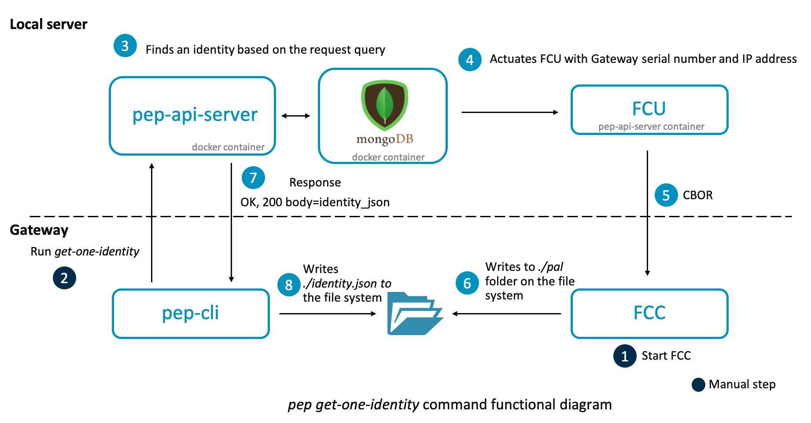

# pelion-edge-provisioner (pep)

It provisions the gateway for Pelion Edge solution to successfully and securely communicate with cloud. This tool hosts REST APIs and mongo database which helps create new and also store gateway-identites. The tool is designed to run on the factory floor and it provisions the gateways in production mode.


## Prerequisite

This tools wraps [Factory Configurator Utility (FCU)](https://www.pelion.com/docs/device-management/current/provisioning-process/index.html). Thus in order to install this tool, following files are required -

1. factory_configurator_utility.zip

    Arm licenses FCU to Device Management customers that manufacture connected devices. Please [contact us](https://cloud.mbed.com/contact) for more information. Authorized customers can download the tool and documentation from the [Device Management Portal](https://portal.mbedcloud.com/login).

1. fcu.yml

    Once the above archive is downloaded, follow the documentation on how to configure fcu - `factory_configurator_utility.zip/docs/provisioning-fcu/configuring-fcu.html`. The default `fcu.yml` can be found here - `factory_configurator_utility.zip/config/fcu.yml`

1. Certificate authority

    Similarly, in order to setup a certificate authority, follow the documentation - `factory_configurator_utility.zip/docs/provisioning-fcu/setting-up-a-certificate-authority.html`.

1. Firmware update certificate

    Note: This step is optional unless firmware update capability is required.

    Follow "Create an authentication certificate" section of [document](https://www.pelion.com/docs/device-management/current/updating-firmware/setting-up.html) to create a firmware update certificate.

1. Place all of the above files in a folder in this structure. Note: Remember to place this folder in this repo directory, as the contents of this repo are copied to the docker container.

    ```
    ./fcu_config_dir
    --- fcu.yml
    --- factory_configurator_utility.zip
    --- update-auth-certificate.der
    --- ca
    --- --- private_key.pem
    --- --- ca.crt
    ```

Manually run the validator `./fcu-config-validator.sh` on fcu_config_dir to verify if the respective files are in above structure.

## Installation

### Install using Docker

Use docker-compose to deploy pep-api-server and mongodb. Pep-api-server image is based on the `ubuntu:bionic` and installs node v10.18.0 and python3.6 dependencies.

The versions of various services used in the docker-compose are listed in the environment file `.env`

For persistent data, docker volume `mongo_data` is created.

#### Build
These docker-compose commands have been tested with docker-compose version 1.25.0

```
$ docker-compose build --build-arg fcu_config=<fcu_config_relative_dir_path>
```
This will also install the factory_configuration_utility in api-server image. Install steps used in this process are parallely followed as listed in the official fcu documentation here - `factory_configurator_utility.zip/docs/provisioning-fcu/index.html`


#### Run

```
docker-compose up -d
```

#### Verify
Verify mongo and api-server containers are running -

```
docker-compose ps
```

If a container is restarting, view the logs in order to troubleshoot -

```
docker-compose logs
```

View api-server logs -

```
docker logs -f pep-api-server
```

Verify mongo_data volume was created successfully -
```
docker volume inspect pelion-edge-provisioner_mongo_data
```

## CLI

### Install

This will create a symlink in the global node_modules folder
```
npm link
```

Run
```
pep --help
```

#### Alternatively
```
npm install
```

Run
```
./cli/pep.js --help
```


Enable debug mode
```
DEBUG=* pep --help
```


If you are runnning pep cli on different machine than the pep-api-server docker container, then change PEP_SERVER_URL like this

```
PEP_SERVER_URL=http://<api-server-ip-address>:5151 pep --help
```


## Typical gateway provision flow

1. Run factory-configurator-client-example on the gateway

    Cross-compile latest version of [fcc-example](https://github.com/ARMmbed/factory-configurator-client-example) for your gateway platform. Instruction to compile fcc-example can be found here - `factory_configurator_utility.zip/docs/ft-demo/building-demo.html`

    Run -
    ```
    $ ./factory-configurator-client-example.elf
    ```

    To change the interface name -
    ```
    ETHERNET_LINUX_IFACE_NAME=eth0 ./factory-configurator-client-example.elf
    ```

    To change the entropy source -
    ```
    export ENTROPYSOURCE=<file-name>
    ```

1. Install the `pep` cli on the gateway and run
    1. `$ pep create-one-identity -s <serial_number> -w <hardware_version>`
        

    1. `$ pep get-one-identity -s <serial_number> -i <gateway_ip> -p <fcc_port>`
        

1. factory-configurator-client-example creates a `pal` folder and get-one-identity creates `identity.json` file.

    1. Place and rename the `pal` folder to the location specified by compile time flag `PAL_FS_MOUNT_POINT_PRIMARY` of mbed-edge.
    1. Place `identity.json` to the location specified by platform_readers/identity_path of maestro configuration file.


## Troubleshooting

1. On gateway when compiling factory-configurator-client-example if you get error

    ```
    ImportError: No module named site
    ```

    then try unsetting the python path

    ```
    unset PYTHONPATH
    unset PYTHONHOME
    ```

1. If mbed-cli is not installed, follow these [instructions](https://os.mbed.com/docs/mbed-os/v5.9/tutorials/quick-start-offline.html)

1. To install factory-configurator-client-example on gateway without mbed-cli, follow steps -

    ```
    $ git clone https://github.com/ARMmbed/factory-configurator-client-example
    $ cd factory-configurator-client-example
    $ git clone https://github.com/ARMmbed/mbed-cloud-client
    $ cd mbed-cloud-client
    $ git checkout <SHA_found_in_mbed-cloud-client.lib>
    $ python pal-platform/pal-platform.py fullbuild --target x86_x64_NativeLinux_mbedtls --toolchain GCC --external ./../linux-config.cmake --name factory-configurator-client-example.elf
    $ ./out/Release/factory-configurator-client-example.elf
    ```

1. If you get `bad-request` error on mbed-edge then mbed-edge and factory-configurator-client-example have been compiled with different entropy source.

1. If you get `Connection error` on mbed-edge then make sure enrollment_id is uploaded successfully on Pelion cloud and also the CA certificate is uploaded.
    1. Steps on how to upload Certificate using Device Management Portal can be found [here](https://www.pelion.com/docs/device-management/current/provisioning-process/managing-ca-certificates.html)
    1. Steps on how to upload enrollment identity can be found [here](https://www.pelion.com/docs/device-management/current/connecting/device-ownership-first-to-claim-by-enrollment-list.html)
